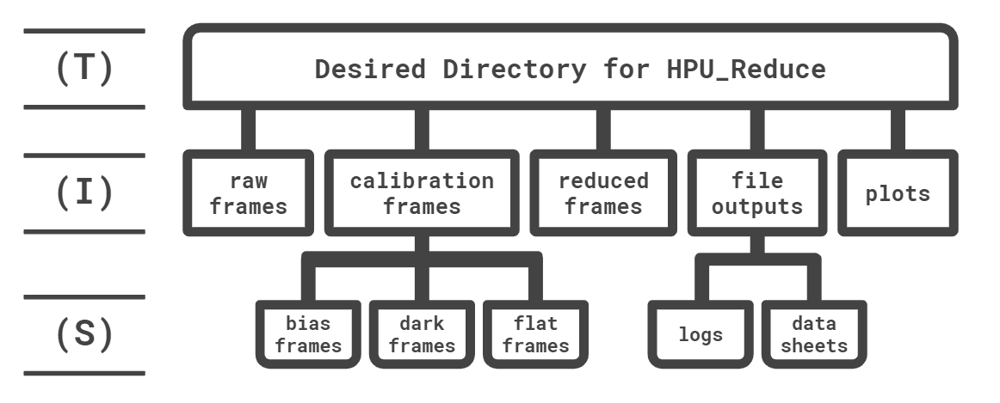

# HPU_Reduce

## The <ins>H</ins>elpful-<ins>P</ins>hotometric-<ins>U</ins>ranoscopy Reduction and Analysis Code
Aperture photometry reduction and analysis code specialized for quick, on-site analysis of data.  This is built with the CTIO/SMARTS 0.9m in mind, but a telescope reference file can be updated to generalize this to other telescopes.

## Installing HPU_Reduce
### Virtual Environment Setup
First, it is recommended that you create a virtual environment specific to HPU_Reduce purposes (I assume the use of an Anaconda virtual environment; follow parallel steps if you prefer to setup virtual environments in a different manner). Make sure your Anaconda is up to date before starting this process as some issues can arise (e.g., installing packages in your root environment rather than the virtual one) if you don't.  Do this by running in your system prompt:
```sh
> conda update conda
```
To create the virtual environment, you will run the following command:
```sh
> conda create -n HPU_Reduce anaconda
```
This will initialize the virtual environment, including a standard Anaconda setup.  You will eventually be prompted to continue the installation like so:
```sh
> Proceed ([y]/n)?
```
Type ```y``` and hit enter to continue.  After the environment is finished being set up, you can then enter the environment and run HPU_Reduce.  To enter the environment simply type:
```sh
> conda activate HPU_Reduce
```
Or, if you are running Windows and using a command prompt (like I am at the time of writing this), you will have to type:
```sh
> activate HPU_Reduce
```
This is due to the command prompt not being a supported terminal to run ```conda activate```. To leave the virtual environment when you are finished, simply type:
```sh
> conda deactivate
```
The subsequent instructions will still work if you do not use a virtual environment; however, it is good practice to use virtual environments to avoid dependency issues.
### Cloning the Github Repository
Now that the virtual environment is setup, navigate to the directory that you wish to run HPU_Reduce in.  We will now clone the repository containing HPU_Reduce and its constituent files.  You can do this by downloading the ```.zip``` file from github or running the following command in your terminal:
```sh
> git clone https://github.com/kacorcoran/HPU_Reduce.git
```
### File Structure Setup
To create all the directories used by HPU_Reduce, you can run the setup.py file with the command:
```sh
> python setup.py
```
Below is a sketch (with a key) of the file structure that is created and subsequently used by HPU_Reduce.  You will have to place your raw science frames in the ```raw_frames``` directory for HPU_Reduce to run.  Calibration frames can be placed in the ```cal_frames``` directory directly or you can sort them into their respective subdirectories if you wish.  Calibration frames are not necessary for HPU_Reduce to run, but you must specify this in the ```analysis_options``` file using ```"calibration": False```.  You do not have to use this file structure if you don't like it - just make the modifications that suit your workflow.

Directory Key:
(T) = Top directory   
(I) = Intermediate directory   
(S) = Subdirectory

